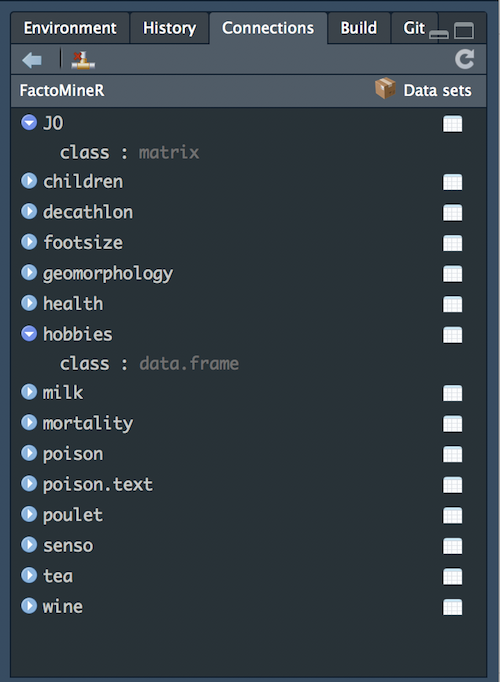
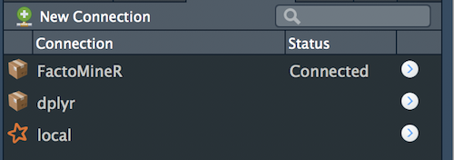
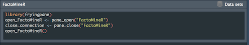

<!-- README.md is generated from README.Rmd. Please edit that file -->

```{r setup, include = FALSE}
knitr::opts_chunk$set(
  collapse = TRUE,
  comment = "#>",
  fig.path = "man/figures/README-",
  out.width = "100%"
)
```

[](https://www.tidyverse.org/lifecycle/#experimental)

# fryingpane

Serve the datasets from a package inside the RStudio Connection Pane.

## Installation

You can install the dev version of {fryingpane} from [Github](https://github.com/ColinFay/fryingpane) with:

```{r eval = FALSE}
# install.packages("remotes")
remotes::install_github("ColinFay/fryingpane")
```

## What is this about? 

### In your package

Use this package to create a function for displaying your package data inside the RStudio Connection Pane. 

Note that `{fryingpane}` should be listed as a dependency to your new package. 

#### Function to launch connection

Create a function that launch the connection pane with the datasets from your package. This function should have this form in the `.R` (change  `mypkg` to the name of your package):

```{r eval = FALSE}
#' Launch Connection Pane
#' @export
#' @importFrom fryingpane serve
#' @example 

open_connection <- fryingpane::serve("mypkg")
```

### View the data from another package

You can open the datasets from another package. 

```{r eval = FALSE}
library(fryingpane)
cook("dplyr")
```



Close the connection with the ad hoc button.

You can find an history of your last connection in the Connections pane.





## Demo 


## Contact

Questions and feedbacks [welcome](mailto:contact@colinfay.me)!

You want to contribute ? Open a [PR](https://github.com/ColinFay/fryingpane/pulls) :) If you encounter a bug or want to suggest an enhancement, please [open an issue](https://github.com/ColinFay/fryingpane/issues).

Please note that this project is released with a [Contributor Code of Conduct](CONDUCT.md). By participating in this project you agree to abide by its terms.
